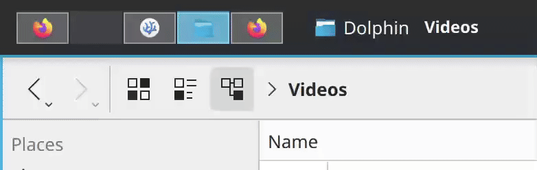

# i3ifiedesk
Python + KWin script to mimic i3's virtual desktop switching behavior (i.e. the dynamic creation and deletion of virtual desktops with shortcuts) in KDE 6. Works best with [krohnkite](https://github.com/anametologin/krohnkite).

See it in action:

## Usage
It is intended to be used as a standalone script. Simply run (or daemonize if you prefer) `i3ifiedesk.py` as long as the two scripts are in the same working directory. No configurations needed since the script will adapt to your custom keybindings for desktop switching.